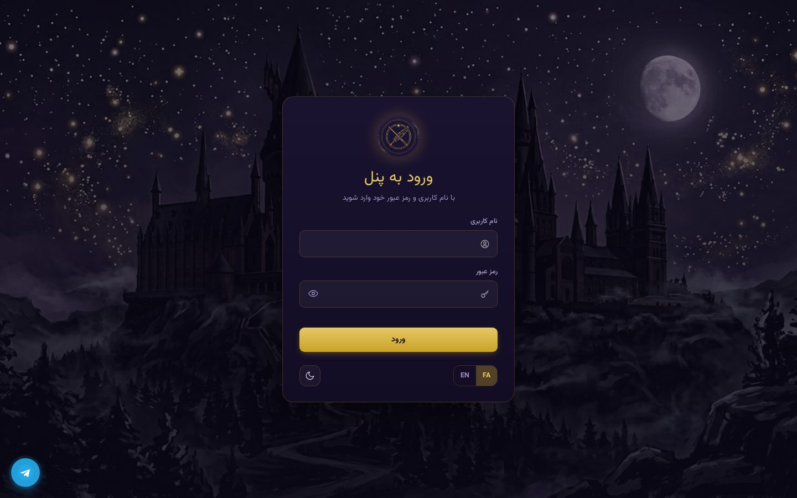
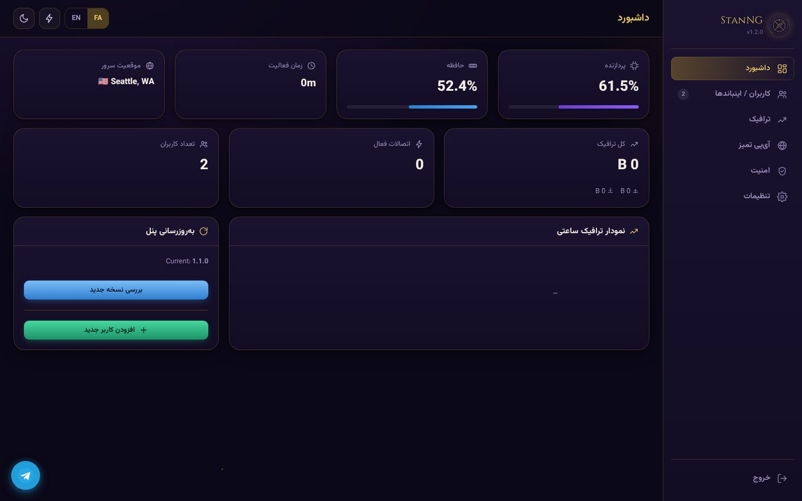
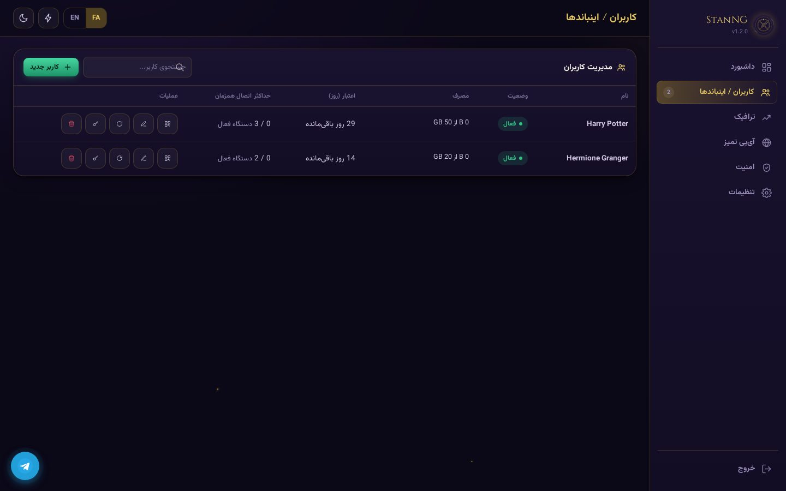
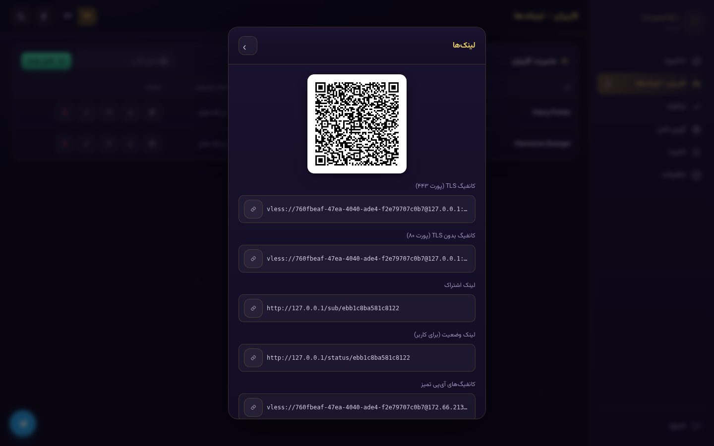
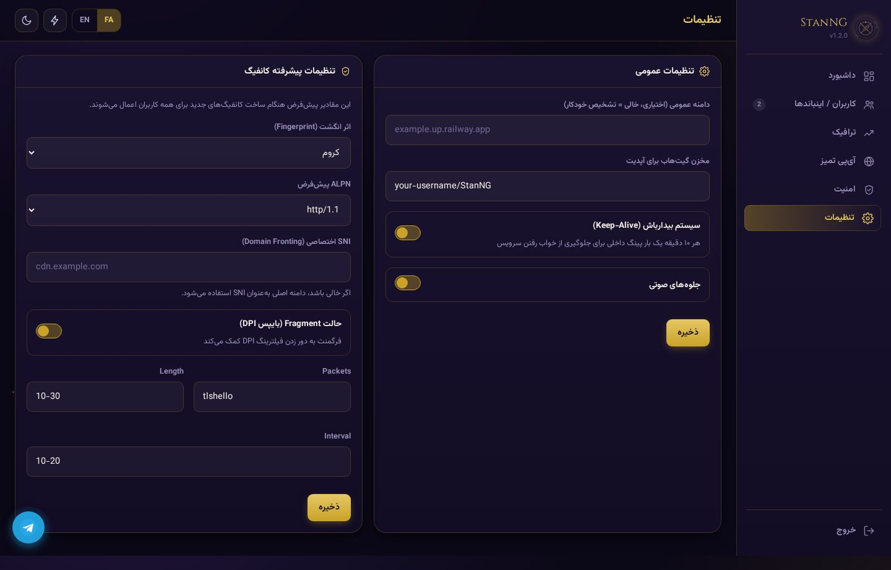
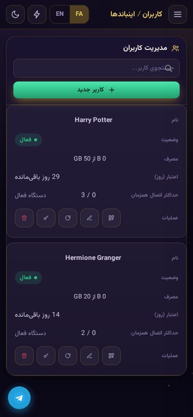

<div align="center">


# ⚡ StanNG v1.5.2

### یک پنل تک‌سرویسهٔ VLESS با تم جادوگری  
**A single‑service VLESS panel with a wizarding theme**

[](https://railway.app/new/template)
[](https://render.com/deploy)



</div>

---

## فهرست | Contents

- [ویژگی‌ها](#-ویژگی‌ها--features)
- [تغییرات نسخه ۱.۵.۲](#-تغییرات-نسخه-۱۵۲--whats-new-in-v152)
- [تصاویر](#-تصاویر--screenshots)
- [نصب سریع](#-نصب-سریع--quick-deploy)
- [راه‌اندازی اولیه](#-راه‌اندازی-اولیه--first-run)
- [متغیرهای محیطی](#-متغیرهای-محیطی--environment-variables)
- [مستندات API](#-مستندات-api--api-reference)
- [امنیت](#-نکات-امنیتی--security-notes)
- [مجوز و اعتبارها](#-مجوز-و-اعتبارها--license--credits)

---

## ✨ ویژگی‌ها | Features

| فارسی | English |
|-------|---------|
| 🪄 **بدون دیتابیس** — همه‌چیز در یک فایل JSON محلی | 🪄 **No database** — everything in one local JSON file |
| 👤 **تنظیم یک‌باره** — اولین بازدید، نام کاربری/رمز را می‌سازد | 👤 **One‑time setup** — first visit creates your credentials |
| 📱 **واکنش‌گرا** — کاملاً سازگار با موبایل | 📱 **Fully responsive** — works great on mobile |
| 📊 **محدودیت‌های پیشرفته** — حجم (GB)، روز اعتبار، سقف درخواست و قطع خودکار | 📊 **Per‑user limits** — quota (GB), expiry, max requests, auto‑cutoff |
| 🔌 **کنترل همزمان** — محدودیت تعداد دستگاه + قفل IP | 🔌 **Concurrent control** — device cap + optional IP locking |
| ⚙️ **تنظیمات سراسری** — Fingerprint، ALPN، SNI، Fragment و پروتکل‌های انتقال (xhttp، ws، doh) | ⚙️ **Global configs** — Fingerprint, ALPN, SNI, Fragment, and transport protocols (xhttp, ws, doh) |
| 🔄 **آپدیت درون‌پنلی** — یک‌کلیک، بدون از دست دادن داده‌ها | 🔄 **In‑panel update** — one‑click, preserves users & settings |
| 🔗 **لینک اشتراک v2rayNG** — خروجی متن ساده (Plain Text) | 🔗 **v2rayNG subscription** — plain‑text output, fully compatible |
| 🛑 **ابطال لینک‌ها** — چرخش UUID برای ابطال آنی | 🛑 **Instant revoke** — one‑click UUID rotation |
| 📱 **صفحه وضعیت عمومی** — لینک عمومی برای رصد مصرف، بدون نیاز به ورود | 📱 **Public status page** — read‑only usage link, no login |
| 🌍 **مکان‌یابی خودکار** — تشخیص شهر/کشور سرور از Cloudflare trace | 🌍 **Auto location** — resolves edge city/country via Cloudflare trace |
| 🌗 **حالت تاریک/روشن + دو زبانه** — فارسی و انگلیسی، فونت محلی | 🌗 **Dark/Light + bilingual** — Persian & English, self‑hosted font |
| 🔊 **جلوه صوتی و انیمیشن** — بدون وابستگی خارجی | 🔊 **Sound & animations** — no external deps |
| 💬 **دکمه پشتیبانی تلگرام** — دسترسی سریع به پشتیبانی | 💬 **Telegram support button** — quick contact |
| ⏱ **بیدارباش خودکار** — پینگ داخلی هر ۱۰ دقیقه | ⏱ **Keep‑alive** — self‑ping every 10 min to prevent sleep |

---

## 🆕 تغییرات نسخه ۱.۵.۲ | What's New in v1.5.2

- ✅ **پشتیبانی از پروتکل‌های انتقال xhttp، ws و doh** — امکان انتخاب نوع انتقال در تنظیمات پیشرفته کانفیگ (برای کانکشن‌های VLESS).  
- ✅ **رفع مشکلات v2rayNG** — encode ایمن پارامترهای `path` و `alpn` برای تشخیص صحیح.  
- ✅ **خروجی متن ساده** — لینک اشتراک به‌صورت Plain Text با لینک‌های VLESS.  
- ✅ **بازگشت کانفیگ‌های نمایشی** — دو کانفیگ نمایشی برای وضعیت مصرف و پیام رایگان به لینک اشتراک اضافه شد.  
- ✅ **حذف Clean IP** — این قابلیت به‌طور کامل حذف شد.  
- ✅ **رفع پروتکل لینک‌ها** — لینک‌های اشتراک همیشه با `https://` ساخته می‌شوند.

---

## 🖼 تصاویر | Screenshots

<table>
<tr>
<td width="50%"></td>
<td width="50%"></td>
</tr>
<tr>
<td align="center"><sub>داشبورد با نمودار ترافیک ساعتی</sub></td>
<td align="center"><sub>مدیریت کاربران و اینباندها</sub></td>
</tr>
<tr>
<td width="50%"></td>
<td width="50%"></td>
</tr>
<tr>
<td align="center"><sub>لینک‌های اشتراک و QR</sub></td>
<td align="center"><sub>تنظیمات عمومی و پیشرفته</sub></td>
</tr>
</table>

<div align="center">

<br><sub>نمای واکنش‌گرا روی موبایل — جدول‌ها به کارت تبدیل می‌شوند</sub>
</div>

---

## 🚀 نصب سریع | Quick Deploy

### 🚂 Railway (توصیه‌شده)
- ریپازیتوری را Fork یا push کنید.
- در [railway.app](https://railway.app) → **New Project → Deploy from GitHub repo**.
- Railway `railway.json` را تشخیص داده و `python main.py` اجرا می‌کند.
- پس از دیپلوی، به آدرس سرویس + `/setup` بروید و نام‌کاربری/رمز عبور بسازید.

> 💡 Railway از IP اختصاصی استفاده می‌کند (نه کلودفلر). در صورت فیلتر، حالت Fragment را از پنل (تنظیمات → پیشرفته) و کلاینت فعال کنید.

### 🌐 Render
- Fork/push به گیت‌هاب.
- در [render.com](https://render.com) → **New → Web Service** → ریپازیتوری را وصل کنید؛ `render.yaml` شناسایی می‌شود.
- بعد از دیپلوی به `/setup` بروید.

> 💡 روی Render پشت شبکهٔ Cloudflare هستید؛ کانفیگ‌ها از آی‌پی‌های تمیز عبور می‌کنند.

### 💻 اجرای محلی
```bash
git clone https://github.com/<your-username>/StanNG.git
cd StanNG
pip install -r requirements.txt
python main.py
# → http://localhost:8000/setup
```

---

## 🧭 راه‌اندازی اولیه | First Run

1. بازدید از `<your-domain>/setup`  
2. ساخت نام‌کاربری و رمز عبور (این همان اعتبار مدیریتی برای همیشه خواهد بود)  
3. پس از ورود، کاربران خود را در بخش **اینباندها** بسازید.  
4. در **تنظیمات** → **تنظیمات پیشرفته کانفیگ** می‌توانید پروتکل انتقال (xhttp، ws، doh) و سایر پارامترها را تغییر دهید.

---

## 🔧 متغیرهای محیطی | Environment Variables

| متغیر | پیش‌فرض | توضیح |
|-------|---------|-------|
| `PORT` | `8000` | پورت اجرا |
| `SECRET_KEY` | (خودکار) | کلید رمزنگاری نشست‌ها (توصیه می‌شود در محیط ابری تنظیم شود) |
| `BASE_PATH` | `""` | در صورت نیاز به مسیر پایه (مثلاً `/stan`) |

---

## 📚 مستندات API | API Reference

| مسیر | متد | توضیح |
|------|------|-------|
| `/api/login` | POST | ورود با username/password، دریافت توکن |
| `/api/users` | GET | لیست تمام کاربران (نیاز به توکن) |
| `/api/users` | POST | ایجاد کاربر جدید (نیاز به توکن) |
| `/api/users/<uid>` | PUT | ویرایش کاربر |
| `/api/users/<uid>` | DELETE | حذف کاربر |
| `/api/users/<uid>/rotate` | POST | چرخش UUID |
| `/api/settings` | GET/PUT | دریافت/ویرایش تنظیمات عمومی و پیشرفته |
| `/api/status` | GET | وضعیت سرور (CPU، RAM، دیسک) |
| `/api/update` | POST | آپدیت خودکار (نیاز به توکن) |
| `/sub/<uid>` | GET | لینک اشتراک متن ساده (عمومی) |
| `/status/<uid>` | GET | صفحه وضعیت عمومی (فقط خواندنی) |

> تمام درخواست‌های محافظت‌شده نیاز به هدر `Authorization: Bearer <token>` دارند.

---

## 🔒 نکات امنیتی | Security Notes

- **رمز عبور** را قوی انتخاب کنید و هرگز به اشتراک نگذارید.  
- **فایل `data.json`** حاوی تمام اطلاعات حساس است؛ از دسترسی مستقیم به آن جلوگیری کنید (مسیریابی نشده).  
- در صورت نشت لینک اشتراک، از دکمه **چرخش UUID** در پنل استفاده کنید تا لینک‌های قبلی بی‌اثر شوند.  
- توصیه می‌شود از HTTPS (مثلاً با Cloudflare یا خود پلتفرم) استفاده شود.

---

## 📜 مجوز و اعتبارها | License & Credits

- این پروژه تحت مجوز **MIT** منتشر شده است.  
- ساخته شده با ❤️ توسط جامعهٔ متن‌باز.  
- فونت **وزیرمتن** (Vazirmatn) با مجوز OFL.  
- نمادها و طراحی الهام‌گرفته از تم جادوگری.  
- **قدردانی ویژه** از مشارکت‌کنندگان محترم:  
  - [**Alireza78na**](https://github.com/Alireza78na) — برای بهبودها و رفع باگ‌های ارزشمند [reference:1]

---

**StanNG** — ساده، سبک، و جادویی 🧙‍♂️
